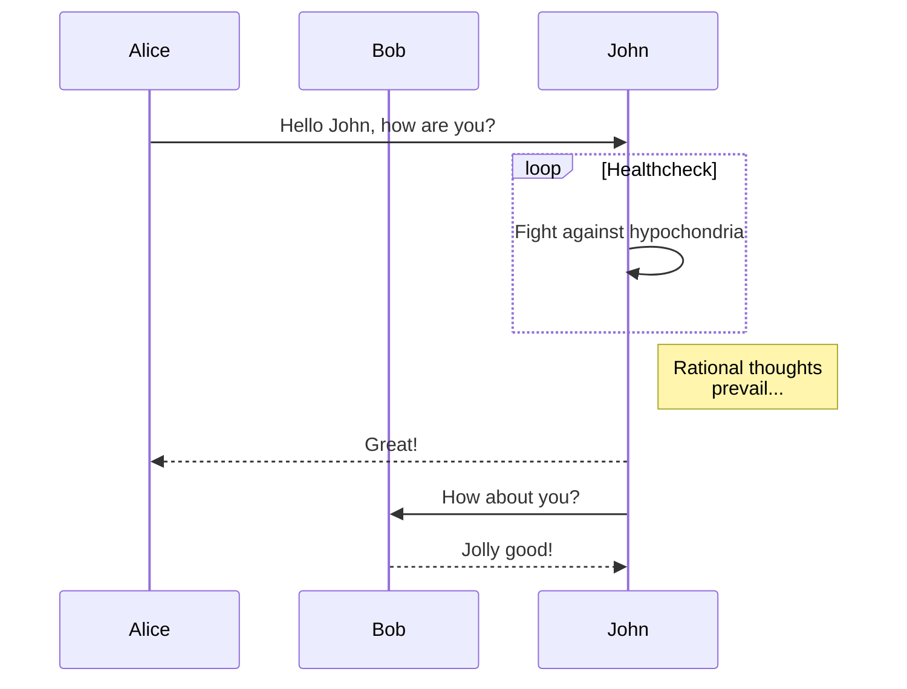

# 简介

Environment接口是Spring对Profile和Property两个方面的抽象，主要处理运行环境对应用程序的影响。

* Profile
    Profile是一个命名的，包含了一些BeanDefinition的逻辑分组，只有当这个profile处于active状态，包含的bean才会注册到容器中，容器通过Environment获取启用的Profile名称。

* Property
    Property就是键值对，来源很多：属性文件、JVM系统属性、系统环境变量、JNDI、servlet context参数、Maps等。Environment通过继承*PropertyResolver*获得Property相关操作（获取Property、解析占位符）

# 实现
目前有两个实现类，StandardEnvironment和StandardWebEnvironment，后者直接继承前者并增加了initPropertySource(ServletContext, ServletConfig)。



```flow
st=>start: Start|past
e=>end: End
op1=>operation: My Operation|past
op2=>operation: Stuff|current
sub1=>subroutine: My Subroutine|invalid
cond=>condition: Yes
or No?|approved
c2=>condition: Good idea|rejected
io=>inputoutput: catch something...|request

st->op1(right)->cond
cond(yes, right)->c2
cond(no)->sub1(left)->op1
c2(yes)->io->e
c2(no)->op2->e
```